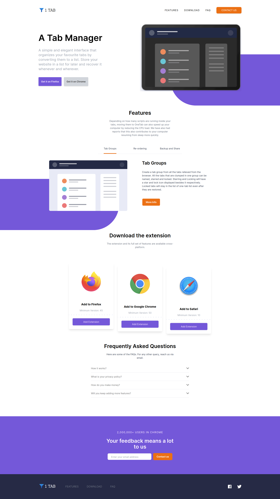
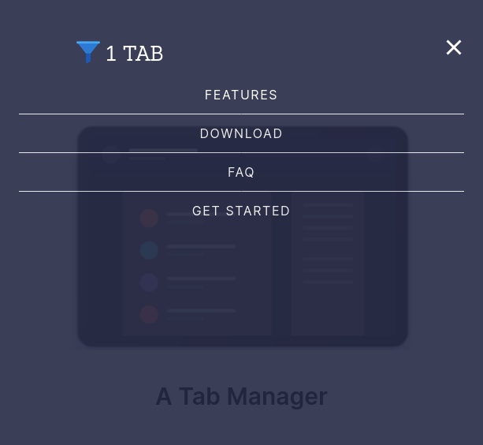
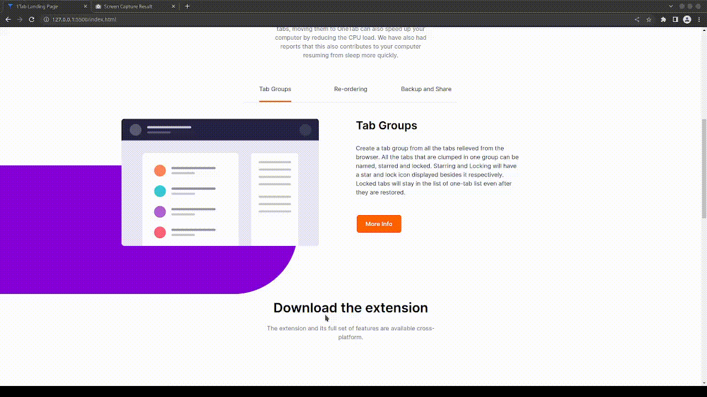
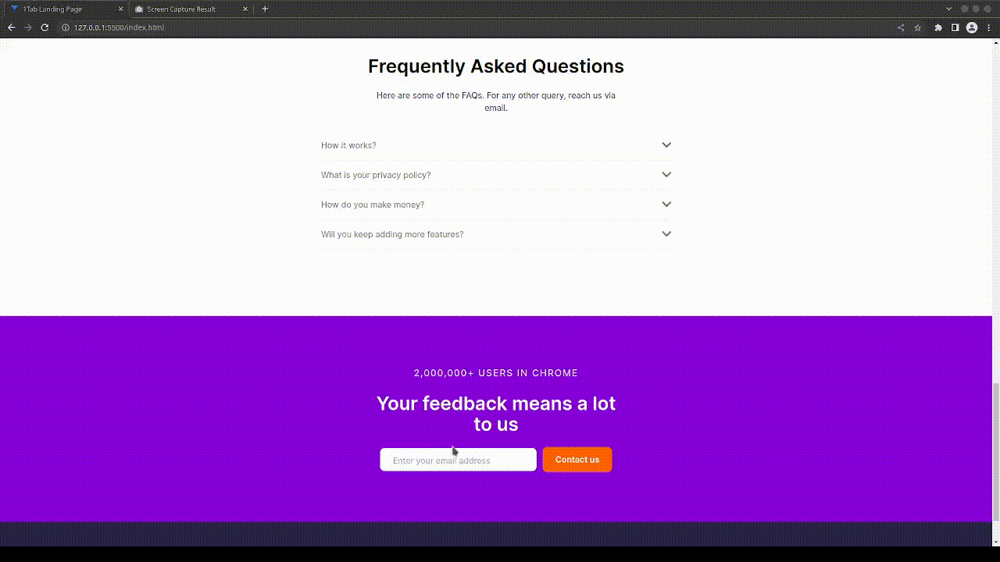

# Onetab Landing Page
Onetab landing homepage made for Udemy Course: TailwindCSS from Scratch and the design is imitated from Frontend Mentor challenge.

This is a homepage concept design for a FOSS (Free and Open Source) browser extension called Onetab which is basically a tab manager, which converts the browser tabs into a list containing their links in list forms. The browser extension is universal i.e., it can be applied on any browser.

This homepage emulates the homepage for many such web based tools that we use daily. As per norm, this project also involved a bit of customization of svg files.

It also features a hanburger menu for smaller resolution devices that envelops the nav bar menu and shows instead a menu in the entire screen. Also, it has base for the svg assets used inside the page. It also contains a tab switcher and inside each of tabs are different contents regarding the product. It also has a collapsable FAQ sections that is prevalent in most product based websites. All of them are achieved using Custom css classes and DOM via Vanilla JavaScript.

# ## Made Using:


## Usage
Install Dependencies:
```
npm install
```
Run Tailwind CLI:
```
npm run watch
```

## Screenshots
### Web-View


### Menu in mobile view


### Features
#### Tab Switching


#### FAQ
